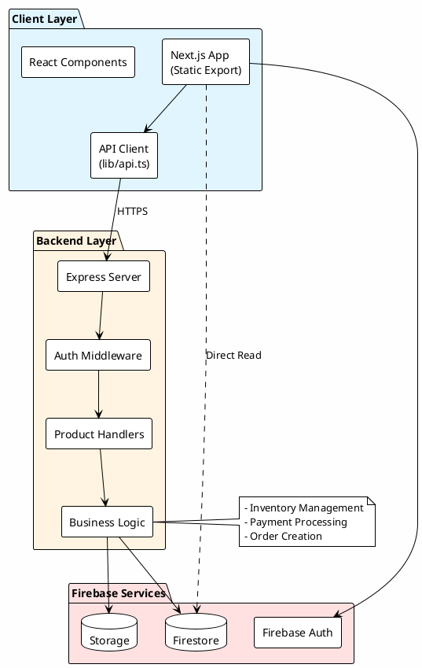
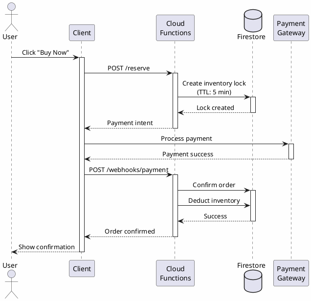
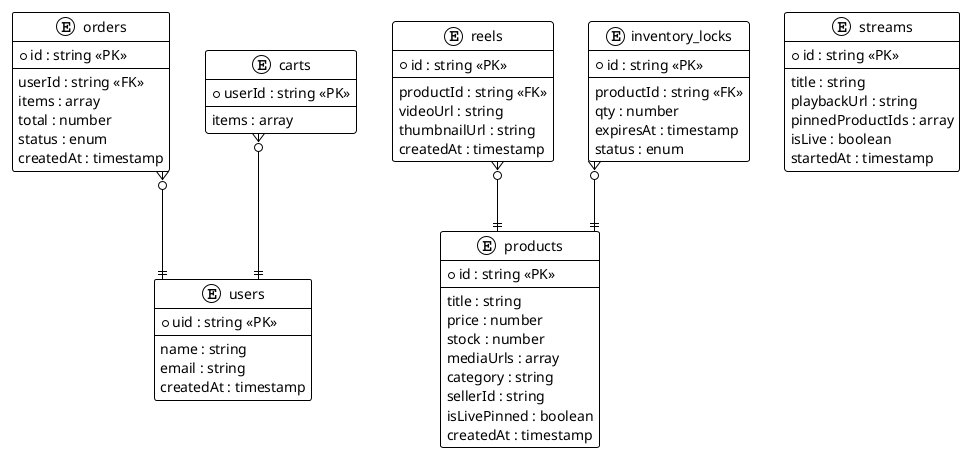

# Live Commerce + Reels Platform

> An India-first live commerce platform enabling users to discover products via short videos (reels) and live streams, with instant purchase capabilities.

---

## 🏗️ System Architecture

### Architecture Overview (Cloud Functions)




---

### Data Flow: Product Purchase




---

### Database Schema (ER Diagram)




---

## 🚀 Getting Started

### Prerequisites

- Node.js 18+ 
- Firebase CLI: `npm install -g firebase-tools`
- Firebase project created

### Installation

```bash
# Install dependencies
npm install

# Install Cloud Functions dependencies
cd functions
npm install
cd ..

# Setup environment variables
cp .env.local.example .env
# Edit .env with your Firebase credentials
```

### Development

```bash
# Run Next.js dev server
npm run dev

# Run Cloud Functions emulator (in separate terminal)
cd functions
npm run serve
```

Open [http://localhost:3000](http://localhost:3000) to see the app.

### Deployment

```bash
# Deploy Cloud Functions
firebase deploy --only functions

# Build and deploy Next.js
npm run build
# Deploy to Vercel/Firebase Hosting
```

---

## 📁 Project Structure

```
live-shop/
├── app/                    # Next.js app directory
│   ├── products/          # Product listing page
│   ├── signin/            # Authentication pages
│   ├── providers/         # React context providers
│   └── ...
├── components/            # Reusable React components
│   ├── ProductCard.tsx
│   └── ProductGrid.tsx
├── functions/             # Firebase Cloud Functions
│   ├── src/
│   │   ├── index.ts      # Express server
│   │   ├── products/     # Product API handlers
│   │   ├── middleware/   # Auth middleware
│   │   └── utils/        # Helper functions
│   └── package.json
├── lib/                   # Shared utilities
│   ├── api.ts            # API client
│   ├── firestore.ts      # Firestore helpers
│   └── types.ts          # TypeScript types
└── public/               # Static assets
```

---

## 🔑 Key Features

### Week 1 (Completed ✅)
- ✅ Firebase Cloud Functions setup
- ✅ Product CRUD APIs
- ✅ Authentication system
- ✅ Product listing UI
- ✅ API client infrastructure

### Week 2 (Planned)
- [ ] Reels data model
- [ ] Video playback with HLS.js
- [ ] Product detail pages

### Week 3 (Planned)
- [ ] Cart functionality
- [ ] Inventory reservation
- [ ] Checkout flow

---

## 🛠️ Tech Stack

**Frontend:**
- Next.js 15 (App Router)
- React 19
- TypeScript
- Tailwind CSS

**Backend:**
- Firebase Cloud Functions
- Express.js
- Firebase Admin SDK

**Database:**
- Firestore (NoSQL)
- Firebase Storage

**Authentication:**
- Firebase Auth (Email/Password + Google OAuth)

**Payment:**
- Razorpay (India)

---

## 📚 Documentation

- [ROADMAP.md](./ROADMAP.md) - Complete MVP roadmap
- [Architecture Decisions](./docs/decisions.md) - ADRs
- [API Documentation](./docs/api.md) - API endpoints

---

## 🔒 Security

- API keys stored in environment variables
- Admin operations protected by middleware
- Firestore security rules enforced
- Payment processing server-side only

---

## 📄 License

MIT

---

## 👥 Contributors

- Mohammed Rayan A ([@Rayan9064](https://github.com/Rayan9064))
